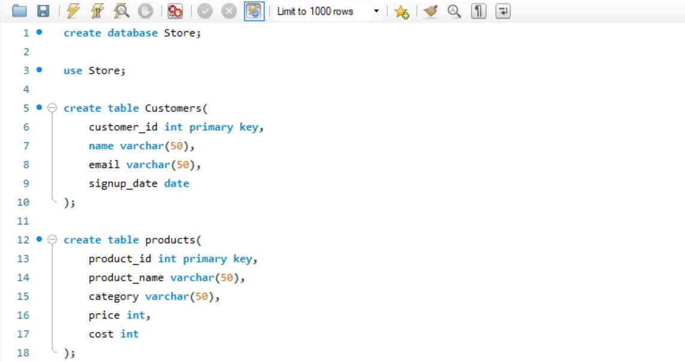
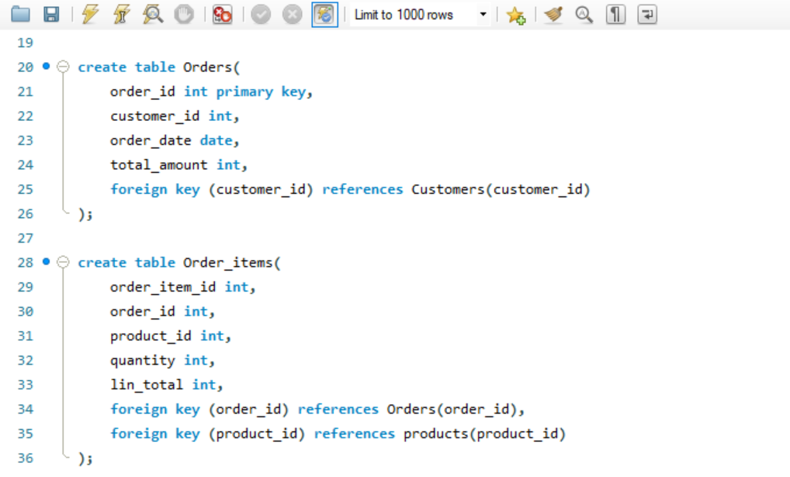
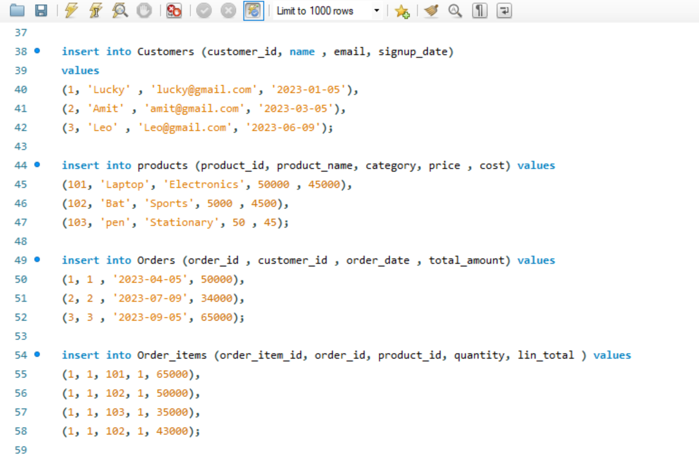
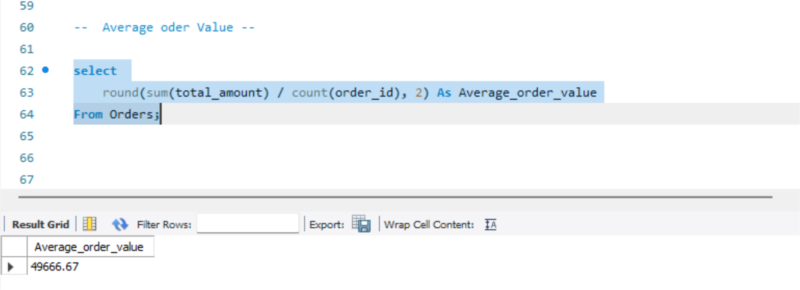
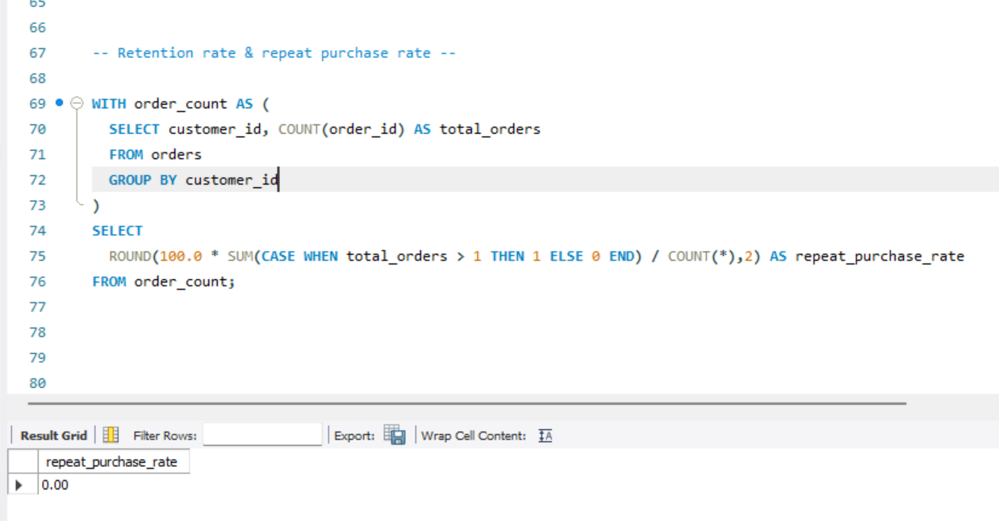
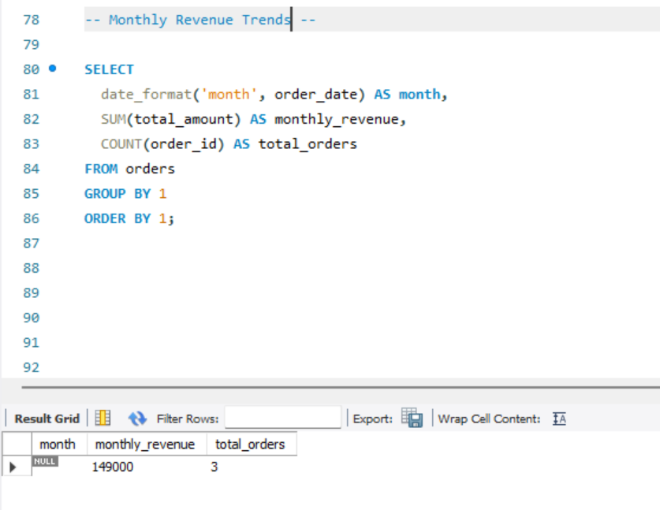
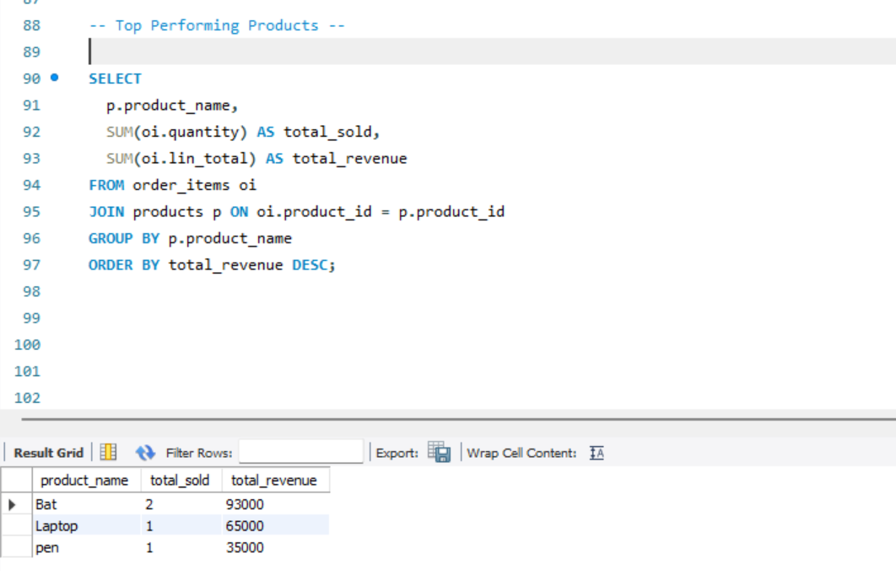

  ---- Project Title ------


```
Online Store Data Analysis – Understanding Customer Behavior & Sales Trends
```

 ------  Goal ------------
```
To analyze an online store’s data to uncover insights about customer behavior, product performance, and business growth trends using SQL, Python, and Power BI.
```

------ Tools Used -----------
```
SQL → Data extraction & joins

Python (Pandas, Matplotlib) → Cleaning, KPIs, and visual analysis

Power BI → Final summary visuals and storytelling

```

------- Key KPIs ------


```
Average Order Value (AOV)

Repeat Purchase Rate

Retention Rate (Cohort)

Monthly Revenue Growth

Top Selling Products

```
-----  Key Analyses ----

```
Average Order Value (AOV)  ✅

Retention rate & repeat purchase rate ✅

Top-performing products ✅

Monthly revenue trends ✅

Cohort retention analysis ✅

```
 --- Screenshots ----

<div style="display:flex; flex-wrap:wrap; gap:10px;"> 
 







</div>


